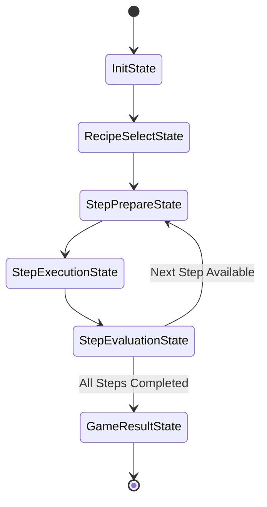

# Indonesian Traditional Cooking Game - Architecture Blueprint

## 1. Modular Architecture Overview

A "Cooking Mama" style game relies on a sequence of Minigame Steps (e.g., Chopping onions, Grinding sambal on a cobek, Stirring rendang, Grilling sate).

To keep this code modular, expandable, and clean:

* **ScriptableObjects (Data Driven):** Recipes, ingredients, and step definitions live in data assets rather than hardcoded logic. Adding new Indonesian dishes (e.g., Nasi Goreng, Soto Ayam, Rendang) requires zero code changes—just new ScriptableObjects and assets.
* **Finite State Machine (FSM):** The main gameplay loop and individual station interactions transition through distinct states to maintain clean control flow.
* **Fuzzy Logic Evaluation Engine:** Instead of rigid boolean passes/fails, cooking outcomes (e.g., doneness, spicy level, spice consistency) are computed using Fuzzy Logic to give dynamic 1 to 3-star ratings.
* **Minigame Interface (`ICookingStep`):** Every step action (chopping, grinding, stirring, timing) implements a common interface so the station manager can load any minigame seamlessly.

---

## 2. Recommended Unity Folder Structure

Inside your Unity project's `Assets/` directory, organize everything under a custom `_Project` folder to keep clean logic separated from default assets and editor files:

```text
Assets/
├── _Project/
│   ├── Art/
│   │   ├── Materials/          # Kitchen surfaces, food textures
│   │   ├── Models/             # 3D Models: Cobek, Wok, Ingredients, Utensils
│   │   ├── Textures/
│   │   └── Animations/         # Cutting motions, boiling water, smoke VFX
│   ├── Audio/
│   │   ├── BGM/                # Traditional background music: Gamelan/Sundanese
│   │   └── SFX/                # Sizzling, chopping impact, timer tick, success
│   ├── Prefabs/
│   │   ├── Environment/        # Kitchen counters, stove setups
│   │   ├── Ingredients/        # Bawang merah, Cabai, Daging, etc.
│   │   ├── Stations/           # Chopping Board, Cobek Station, Stove Station
│   │   └── UI/                 # Step Prompts, Rating Popups, HUD elements
│   ├── Scenes/
│   │   ├── MainMenu.unity
│   │   └── Gameplay.unity
│   ├── ScriptableObjects/
│   │   ├── Ingredients/        # Data assets for ingredients
│   │   ├── Recipes/            # Data assets for dishes: Rendang, Sambal, etc.
│   │   └── Steps/              # Data assets defining specific step requirements
│   └── Scripts/
│       ├── Core/               # GameManager, LevelManager, SoundManager
│       ├── FSM/                # Base FSM classes and Game State implementations
│       ├── FuzzyLogic/         # Membership Functions, Rule Base, Defuzzifier
│       ├── Data/               # RecipeSO, IngredientSO, StepSO
│       ├── Input/              # Touch/Gesture Input Controller
│       ├── Minigames/          # ChopStep, GrindStep, StirStep, HeatControlStep
│       ├── UI/                 # RecipeSelectionUI, CookingHUD, ResultUI
│       └── Utilities/          # Object Pooling, Audio helpers
├── Settings/                   # URP Pipeline assets
└── Plugins/
```

---

## 3. Scene Hierarchies (Parent-Child Structure)

Below are the recommended GameObject structures for both scenes in the game, optimized for plain text rendering on GitHub.

### A. MainMenu.unity Scene Hierarchy

```text
[MainMenu Scene]
├── --- MANAGERS ---
│   ├── MainMenuManager         (UI navigation, panel transitions, scene loading)
│   ├── AudioManager            (Menu BGM and UI button click SFX)
│   └── SaveDataManager         (Player high scores, star ratings, unlocked recipes)
│
├── --- ENVIRONMENT ---
│   ├── Main Camera             (Static / slow-orbit camera on menu diorama)
│   ├── Directional Light       (Warm kitchen lighting)
│   └── MenuBackgroundDiorama   (3D scene: traditional Indonesian Warung / Kitchen)
│
└── --- UI CANVAS ---
    ├── MenuCanvas              (Screen Space - Overlay)
    │   ├── MainMenuPanel       (Default View)
    │   │   ├── GameTitle       (Text / Logo)
    │   │   ├── PlayButton      (Opens RecipeSelectPanel)
    │   │   ├── GalleryButton   (Opens RecipeBook / Achievements)
    │   │   ├── SettingsButton  (Opens SettingsPanel)
    │   │   └── QuitButton      (Exits game on Android)
    │   │
    │   ├── RecipeSelectPanel   (Scrollable list or carousel of traditional recipes)
    │   │   ├── RecipeList      (Grid: Sambal Terasi, Rendang, Soto, etc.)
    │   │   ├── RecipeDetailCard(Selected recipe info, best score/stars earned)
    │   │   ├── StartCookButton (Loads Gameplay.unity with chosen recipe)
    │   │   └── BackButton
    │   │
    │   ├── SettingsPanel       (Game preferences)
    │   │   ├── VolumeSliders   (BGM and SFX volume)
    │   │   ├── QualityDropdown (Graphics quality settings)
    │   │   └── BackButton
    │   │
    │   └── AchievementsPanel   (Unlocked dishes, master chef trophies, total stars)
    │       └── BackButton
    │
    └── EventSystem             (Handles UI touch interactions)
```

### B. Gameplay.unity Scene Hierarchy

```text
[Gameplay Scene]
├── --- MANAGERS ---
│   ├── GameManager             (Main FSM: Init -> Prep -> Cooking -> Result)
│   ├── RecipeManager           (Active recipe, step queue, current step index)
│   ├── InputManager            (Translates Android touch/gestures to engine events)
│   ├── FuzzyEvaluationManager  (Runs Fuzzy Logic calculations on step completion)
│   └── AudioManager            (BGM and cooking SFX player)
│
├── --- ENVIRONMENT ---
│   ├── Main Camera             (3D Perspective Camera focused on active station)
│   ├── Directional Light       (Main kitchen lighting)
│   ├── Lighting Environment    (URP Reflection Probes, Volume effects)
│   └── KitchenCounter          (Static 3D table/background prefab)
│
├── --- COOKING STATIONS ---    (Parent container for interactive areas)
│   ├── Station_ChoppingBoard   (Spawn point for Chopping minigame)
│   │   ├── BoardMesh           (Visual 3D model)
│   │   ├── KnifeObject         (Interactive utensil)
│   │   └── IngredientSpawnPos  (Transform marker for active ingredient)
│   │
│   ├── Station_Cobek           (Spawn point for Ulek/Grinding minigame)
│   │   ├── MortarMesh          (Cobek model)
│   │   ├── PestleObject        (Ulekan model - moved by touch)
│   │   └── SpiceSpawnPos       (Transform marker for spices)
│   │
│   └── Station_Stove           (Spawn point for Frying/Boiling/Grilling)
│       ├── PanMesh / WokMesh
│       ├── FireVFX             (Particle System for heat)
│       └── SpatulaObject
│
└── --- UI CANVAS ---
    ├── HUDCanvas               (Screen Space - Overlay)
    │   ├── TopPanel            (Pause Button, Recipe Name, Step Progress Bar, Timer)
    │   ├── GesturePrompt       (Animated prompt for swipe/drag/tap)
    │   ├── ScoreMeter          (Visual feedback: Perfect / Good / Miss)
    │   └── DialoguePanel       (Instructions e.g., "Ulek cabai sampai halus!")
    │
    ├── ResultCanvas            (Shown on step/recipe finish)
    │   ├── StarRating          (1 to 3 Stars calculated by Fuzzy Engine)
    │   ├── Score Breakdown     (Doneness, Texture, Speed)
    │   └── NextStepButton / RetryButton
    │
    └── EventSystem             (Handles touch input on UI elements)
```

---

## 4. Finite State Machine (FSM) Architecture

This diagram uses standard GitHub-native Mermaid syntax, which will render automatically as a visual flow diagram in `README.md` or GitHub preview.



### Text Alternative

```text
       [ InitState ]
             │
             ▼
   [ RecipeSelectState ]
             │
             ▼
   [ StepPrepareState ] ◄──────────┐ (Next Step)
             │                     │
             ▼                     │
   [ StepExecutionState ] ─────────┤
             │                     │
             ▼                     │
   [ StepEvaluationState ] ────────┘
             │ (All Steps Completed)
             ▼
    [ GameResultState ]
```

### State Definitions

* **InitState:** Initializes assets, object pools, settings, and input listeners.
* **RecipeSelectState:** Displays dish choices (e.g., Sambal Terasi, Rendang, Soto).
* **StepPrepareState:** Activates necessary 3D station (e.g., Cobek), spawns ingredients, sets camera target.
* **StepExecutionState:** Delegates control to active `ICookingStep` script, receiving touch gestures.
* **StepEvaluationState:** Passes execution metrics (time, precision, heat) to the Fuzzy Engine.
* **GameResultState:** Compiles final dish score, displays overall star rating, unlocks next recipes.

---

## 5. Fuzzy Logic Evaluation System

Instead of simple Pass/Fail timers, traditional cooking quality is dynamic. We use a Mamdani Fuzzy Inference System to calculate a precise dish score based on continuous user inputs.

### Example: Stove Cooking / Stirring Evaluation

#### 1. Input Variables & Linguistic Terms
* **Heat Level ($H$):** { Low, Optimal, High }
* **Duration ($T$):** { Short, Ideal, Long }
* **Stirring Consistency ($C$):** { Irregular, Smooth }

#### 2. Fuzzy Membership Functions
Each variable is mapped to a membership degree $\mu(x) \in [0, 1]$.
* **Ideal Cooking Time:** Triangular membership function centered at $T_{\text{target}}$.
* **Heat Level:** Trapezoidal functions for Low/High, Gaussian/Triangular for Optimal.

#### 3. Fuzzy Rule Base (Sample Rules)
* **RULE 1:** IF Heat IS Optimal AND Duration IS Ideal AND Consistency IS Smooth THEN Quality IS Perfect
* **RULE 2:** IF Heat IS High AND Duration IS Long THEN Quality IS Burnt
* **RULE 3:** IF Duration IS Short THEN Quality IS Undercooked
* **RULE 4:** IF Heat IS Low AND Duration IS Ideal THEN Quality IS Acceptable

#### 4. Defuzzification
Using the Center of Gravity (Centroid) method, fuzzy outputs are transformed into a crisp score $S \in [0, 100]$:

$$S = \frac{\sum x_i \cdot \mu(x_i)}{\sum \mu(x_i)}$$

* **90 – 100 Score:** 3 Stars (Perfect Dish)
* **65 – 89 Score:** 2 Stars (Good Dish)
* **40 – 64 Score:** 1 Star (Passable Dish)
* **< 40 Score:** Failed (Burnt / Inedible)

---

## 6. Script & Data Interfaces

### `ICookingStep` Modular Interface

```csharp
using UnityEngine;

public interface ICookingStep
{
    void InitializeStep(StepSO stepData);
    void ProcessInput(Vector2 touchPosition, TouchPhase phase);
    void UpdateStepLogic();
    float GetCompletionPercentage();
    bool IsStepComplete();
    StepPerformanceData ExportPerformanceData();
    void TerminateStep();
}
```

---

## 7. Next Implementation Steps

1. **Clean Project Assets:** Remove default template files (`TutorialInfo`) from `Assets/`.
2. **Directory Creation:** Create the `Assets/_Project/` directory structure outlined in Section 2.
3. **Core Data Structures:** Create `IngredientSO`, `StepSO`, and `RecipeSO` script files.
4. **FSM Framework:** Write the abstract `State` class and `StateMachine` controller.
5. **Fuzzy Logic Core:** Build standard triangular/trapezoidal membership functions for scoring.
